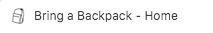
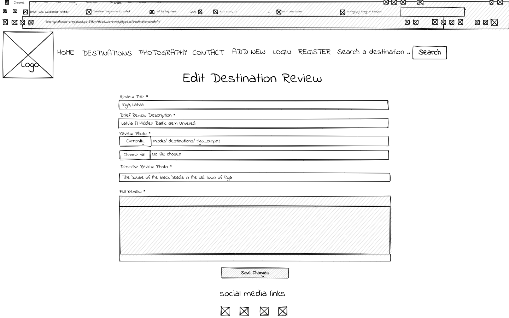
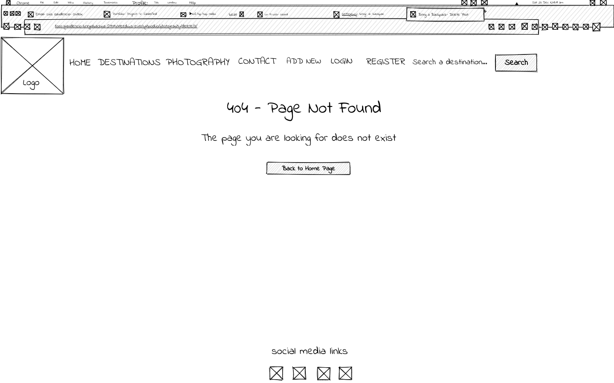

# Bring a Backpack

Bring a Backpack is a site for reviewing travel destinations and photography sharing. Users from around the world can sign up and add their travel reviews to the website and share their photography skills with other travel enthusiasts and helpfully help other users decide on their next journey. The site provides users with a simple and easy system to write their reviews, upload pictures and customise their profile. The live link to the site can be found here: Live Site - Bring a Backpack

## User Experience Design

### The Strategy Plane

#### Site Goals

The site is aimed at all travel enthusiasts who are planning their next adventure and would like a source of inspiration from other fellow travellers. Site users can sign up, login, create a destination review and the published reviews can be easily edited or even deleted. Users can also share their photography skills but creating posts with 10 images, just like the destination reviews, these posts can be edited and deleted when needed. Additionally, users have their own profiles, it will show other users their recent reviews/posts. The profile can also be edited, such as info and the display picture. 

#### Agile Planning 

This project was developed using agile methodologies, delivering small features at a time. All projects were assigned to epics, prioritised under labels - Must have, Should have and Could have. The core project requirements were given the ‘Must have’ label to ensure they were prioritised and completed before moving onto the requirements that had the other two labels. 

The Kanban board was created using Github projects and can be seen here and can be viewed to see more information on the project cards. Most stories will have acceptance criteria to define its function, once the function has been met, it is then marked off as completed. 

##### Epics

The project had 8 main Epics (milestones):

**EPIC 1 – Base Setup**
 
The base setup epic is for all stories needed for the base set up of the application. Without the base setup, the app would not be possible, therefore it was the first epic to be delivered as all other features will depend on the completion of the base setup. 

**EPIC 2 – Authentication**

The authentication epic is for all stories that are related to the sign up, login and authorisation of views. Authorisation provides crucial and critical functionality, as without it, users would not be able to make a destination review and/or a photography post securely without the threat of other site users being able to edit or delete their review and/or photos.

**EPIC 3 – Destinations**

The destinations epic is for all stories that relate to creating, viewing, editing and deleting a destination review. This allows site visitors to view all destination reviews and it allows registered users to manage their own reviews by using a simple to use user interface.

**EPIC 4 - Profiles**

The profiles epic is for all stories relating to creating and editing a profile. This allows all signed up users to be able to create their own profiles and edit them as they wish. Users can add such things as, a name, display picture, nationality, type of traveller and a bio. 

**EPIC 5 - Photography** 

The destinations epic is for all stories that relate to creating, viewing, editing and deleting a photography post. This allows site visitors to view all photography posts and it allows registered users to manage their own posts by using a simple to use user interface.

**EPIC 6 - Stand alone pages**

The stand alone pages epic is for small pages that did not have enough stories to warrant their own full epics. Therefore, these small deliverables were added under this one epic. 

**EPIC 7 - Deployment**

This epic is relating to the deployment of the app to heroku so that the site can be made live for all users.

**EPIC 8 - Documentation**

This epic is relating to all document related stories and tasks that are needed to document the software development lifecycle of the application. It aims to deliver quality documentation, explains all stages of development and necessary information on running, deploying and using the application. 

##### User Stories

**EPIC 1 - Base Setup**

As a developer, I need to set up the project so that it is ready to implement the core features

As a developer, I need to create a logo and navbar so that the user can navigate around the site across any given device

As a developer, I need to create a footer with social media links so that the user can keep up with new destination reviews across various social media platforms

As a developer, I need to create static resources so that images, CSS and JavaScript work on the website 

As a developer I need to create a base.html page and structure so that all other pages across the site can reused the layout 

**EPIC 2 - Authentication**

As a developer I need to implement allauth so that users can sign up and have access to the sites features 

As a site owner I would like the allauth pages to be customised so that they fit into the rest of the site design 

**EPIC 3 - Destinations** 

As a user I want to see all travel destination reviews so that I can decide whether to travel to that specific city/country 

As a user I want to be able to create new travel reviews so that I can share my travel experiences 

As a user I want to be able to edit travel review entries so that I can add any new information 

As a user I want to be able to delete a destination review entry 

As a user I would like to receive feedback when I create, edit or delete a destination review so that I can see it has been successful

As a user I want to be able to search for a specific destination so that I can save time by not needing to scroll down on recent destinations

**EPIC 4 - Profiles**

As a user I want to create a profile so that when I sign up, users can navigate to my profile and see the reviews I wrote
 
As a user I want to edit my profile so that I can make changes when needed 

As a user I want to view another users profile so that I can see all their posted destination reviews 

As a user I would like to receive feedback when I edit my profile so that I can see that it has been done successfully

**EPIC 5 - Photography** 

As a user I want to see photography posts by other users so that I can see how they have captured their visited destination 

As a user I want to be able to create photography posts so that I can share it with my community 

As a user I want to be able to edit my photography post so that I can add or delete any pictures 

As a user I want to be able to delete a photography post

As a user I would like to receive feedback when I create, edit and delete a photography posts so that I can see that it has been successful

**EPIC 6 - Stand alone pages**

As a site owner I would like a homepage so that site users are greeted with a welcoming landing page explaining the site and has key links 

As a developer I need to implement a 403 error page for unauthorised users to be redirected so that I can secure my views 

As a developer I need to implement a 404 error page so that users are alerted when they have landed on a page that does not exist 

As a developer I need to implement a 500 error page so that users are alerted when an internal server error occurs

**EPIC 7 - Deployment** 

As a developer I need to deploy the project to heroku so that it is live for users 

**EPIC 8 - Documentation**

Task: 

Complete the readme documentation 

### The Scope Plane

* The site must have responsive design, it should be fully functional on all devices from 320px and above.

* Hamburger menu must be displays on mobile devices.

* Ability to perform CRUD functionality on the Destination Reviews and the Photography Posts.

* Restricted roles based on features.

* Home must contain information about the site and quick links to some pages.

### The Structure Plane

#### Features 

USER STORY – As a developer, I need to create a navbar so that the user can navigate around the site across any given device

Implementation:

**Navigation Menu**

The Navigation contains links for Home, Photography, Destinations and has Allauth options.

The following are navigation items that are available on all pages around the website:

* Home > index.html - Visible to all
* Destinations > destinations.html – Visible to all
* Photography > photography.html – Visible to all
* Add New (Dropdown):
    * Add Destination > destination_full_review.html – Visible to all logged in users
    * Add Photography > photography_full_post.html - Visible to all logged in users
* Profile > profile.html – Visible to all logged in users
* Login > login.html - Visible to all logged out users
* Register > signup.html - Visible to logged out users
* Logout > loutout.html - Visible to logged in users

The navigation bar is displayed on all pages across the website and collapses into a hamburger menu on smaller devices. This will allow users on smaller devices to navigate around the website and it will not take up too much space.

USER STORY – As a site owner I would like a homepage so that site users are greeted with a welcoming landing page explaining the site and has key links 

Implementation:

**Homepage**

The homepage consists of a heading, which will have a welcome message to the website.

Under the heading, it will have information about the website and what it aims to achieve, so any users that reads will know the purpose of the website.

Under the main information, the user will be presented with three links – Photography, Destinations and Contact. These links will serve as a quick way to the respective pages.

USER STORY – As a developer, I need to create a footer with social media links so that the user can keep up with new destination reviews across various social media platforms

Implementation:

**Footer**

A footer has been added to the bottom of the website, this will contain links to social media accounts, which are: Facebook, Instagram, X and Pinterest. These links are for site users to follow us on these platforms and keep up with news on recent photography posts and destination reviews. The social media icons have aria-labels added to ensure that users who use screen readers know the purpose of the links. Once clicked, they will open up in a new tab, as they lead users away from the site.

USER STORY – As a user I want to be able to create new travel reviews so that I can share my travel experiences 

Implementation:

**Create Destination Review**

A create destination review page was implemented to allow all site users the ability to add their own reviews via the UI without having to use the backend admin panel. This allows users to add destination reviews so it can be seen and read by all other site users, regardless of login status.

USER STORY – As a user I want to see all travel destination reviews so that I can decide whether to travel to that specific city/country 

Implementation:

**View Destination Review Page**

A destination review page has been implemented to allow site users to see all published destination reviews in order of date posted, that way the most recent reviews are shown first. The published destination reviews are visible to all site users, regardless of login status. It would not be user friendly to restrict this information from users to force them into signing in.

USER STORY – As a user I want to be able to edit travel review entries so that I can add any new information 

Implementation:

**Edit Destination Review Page**

On the destination review page, an edit button was added to the bottom of the review, this way the review owner is able to edit their destination review. This button will only be displayed if the user is logged in.

USER STORY – As a user I want to be able to delete a destination review entry 

Implementation:

**Delete Destination Review Page**

On the destination review page, a delete button was added to the bottom of the review, this way the review owner is able to delete their destination review. This button will only be displayed if the user is logged in.

USER STORY - As a user I would like to receive feedback when I create, edit or delete a destination review so that I can see it has been successful

Implementation: 

**Toasts**

Custom toasts were added on when a destination review was successfully created, edited and deleted. These success messages are used to give feedback to the users that their request was successful. 

USER STORY – As a user I want to be able to create photography posts so that I can share it with my community 

Implementation:

**Create Photography Post**

A create photography post page was implemented to allow all site users the ability to add their own photos via the UI without having to use the backend admin panel. This allows users to add photography posts so it can be seen and read by all other site users, regardless of login status.

USER STORY – As a user I want to see photography posts by other users so that I can see how they have captured their visited destination 

Implementation:

**View Photography Post**

A photography post page has been implemented to allow site users to see all published photo posts in order of date posted, that way the most recent reviews are shown first. The published posts are visible to all site users, regardless of login status. It would not be user friendly to restrict this information from users to force them into signing in.

USER STORY – As a user I want to be able to edit my photography post so that I can add or delete any pictures 

Implementation:

**Edit Photography Post**

On the photography post page, an edit button was added to the bottom of the post, this way the review owner is able to edit their photos. This button will only be displayed if the user is logged in.

USER STORY – As a user I want to be able to delete a destination review entry 

Implementation:

**Delete Photography Post**

On the photography post page, a delete button was added to the bottom of the post, this way the review owner is able to delete their photography post. This button will only be displayed if the user is logged in.

USER STORY - As a user I would like to receive feedback when I create, edit and delete a photography posts so that I can see that it has been successful

Implementation: 

**Toasts**

Custom toasts were added on when a photography post was successfully created, edited and deleted. These success messages are used to give feedback to the users that their request was successful. 

USER STORY – As a site user, I want to be able to search a photography post or a destination review, so that it saves users time from scrolling the page

Implementation:

**Search Bar**

A search bar was added to the navbar to allow all site users to find either a photography post or a destination review. It will allow all site users to find posts and/or reviews by typing in the city or country. By adding a search bar, it will allow all users to save time and find what they are looking for quicker.

USER STORY – As a user I want to create a profile so that when I sign up, users can navigate to my profile and see the reviews I wrote

Implementation:

**Create Profile**

Once the user is registered and logged in, a profile will automatically be created. It would be up to the user to go into their profile and complete it as they wish. To add information to their profile they can navigate to the Profile link on the navbar and click on the Edit Profile button. Once clicked, this will open up a modal where the information can be added. Once changes have been made, click on the Save Changes button at the bottom of the modal to fill in the profile. 

USER STORY – As a user I want to edit my profile so that I can make changes when needed 

Implementation:

**Edit Profile** 

If the user wishes to change anything on their profile, they can navigate to the Profile link on the navbar and click on the Edit Profile button. Once clicked, this will open up a modal where the information can be updated. Once changes have been made, click on the Save Changes button at the bottom of the modal to update the profile. 

USER STORY - As a user I would like to receive feedback when I edit my profile so that I can see that it has been done successfully

Implementation:

**Toasts**

Custom toasts were added on when a user edits their profile. These success messages are used to give feedback to the users that their request was successful. 

USER STORY – As a developer, I want users to identify the website tab if they have multiple tabs opened.

Implementation:

**Favicon**

A site wide favicon was implemented, therefore, users will be able to easily identify the site amongst many tabs by the favicon image.

**Error Pages**

USER STORY – As a developer I need to implement a 403 error page for unauthorised users to be redirected so that I can secure my views 

Implementation:

**403 Page**

A 403 error page has been implemented to provide feedback to users when they try to access any unauthorised content. Users will see this error if they alter the URLs and attempt to edit, delete or access the pages that are restricted. 

Users will be able to return back to the homepage via a button displayed on the 403 error page, thus eliminating the need to use the browsers back button. 

This covers: 

* Create Destination Review: Authorised to all signed in members 
* Edit Destination Review: Authorised to all signed in members and only the publisher of the review can edit their own review
* Delete Destination Review: Authorised to all signed in members and only the publisher of the review can delete their own review
* Create Photography Post: Authorised to all signed in members  
* Edit Photography Post: Authorised to all signed in members and only the publisher of the post can update their own photos
* Delete Photography Post: Authorised to all signed in members and only the publisher of the post can delete their own post 

USER STORY - As a developer I need to implement a 404 error page so that users are alerted when they have landed on a page that does not exist 

Implementation: 

**404 Page**

A 404 error page has been implemented to provide feedback to users when they have access a page that does not exist or if they come across a broken link. 

Users will be able to return back to the homepage via a button displayed on the 404 error page, thus eliminating the need to use the browsers back button.

USER STORY - As a developer I need to implement a 500 error page so that users are alerted when an internal server error occurs

Implementation: 

**500 page**

A 500 error page has been implemented to provide feedback to users when an internal server error occurs. 

Users will be able to return back to the homepage via a button displayed on the 500 error page, thus eliminating the need to use the browsers back button.

##### Features Left To Implement 

In a future release I would like to implement a hacks page. At the moment, the website has a section on destination reviews which gives an insight on how travellers found a certain city/country. It also has a photography section so travellers could share their travel shots. With a hacks page, travellers can share hacks with other users, which could included budget tips, good deals or best way to get from the airport to the city center. This feature would be an additional bonus to what the website already offers. 

### The Skeleton Plane

#### Wireframes

Desktop Wireframes

* Homepage 

* Sign up Page

* Login Page

* Logout Page

* View Destination Review 

* Create Destination Review 

* Edit Destination Review

* Delete Destination Review 

* View Photography Post 

* Create Photography Post 

* Edit Photography Post 

* Delete Photography Post 

* View Profile

* Edit Profile

* 404 Error

* 403 Error

* 500 Error

Mobile Wireframes

* Homepage 

* Sign up Page

* Login Page

* Logout Page

* View Destination Review 

* Create Destination Review 

* Edit Destination Review

* Delete Destination Review 

* View Photography Post 

* Create Photography Post 

* Edit Destination Review

* Delete Photography Post 

* View Profile

* Edit Profile

* 404 Error

* 403 Error

* 500 Error

#### Database Design

The database was designed to allow CRUD functionality, which is available to users when they are signed in. The user model is at the heart of the application as it is connected to the destination reviews, photography posts and profile, linked by primary/foreign key relationship. 

An entity relationship diagram was created using [DBeaver](https://dbeaver.io/) and shows the schemas for each of the models and how they are related. 

#### Security

View were secured by using the built-in Django class based view mixin - UserPassesTestMixin. A test function was created in the necessary classes to use the mixin and checks were ran to ensure that the user trying to access the specific page was authorised to do so. All restrictions, such as edit/delete functionalities listed in the features section was secured bu using this method. 

Environment variables were stored in an env.py for local development for security purposes, this is to ensure no secret keys, API keys or sensitive information was added to the repository. 

### The Surface Plane

#### Design 

#### Colour Scheme

The main colour schemes for the website are as follows:

* White (#FFFFFF) – This colour was used for the background of the website and for text inside all buttons.

* Black (#000000) – This colour was used for all text used in the website and all button background colours.

* Blue (#007EA7) – This colour was used in two places. First, it was used for the active class, this way the user will know on what page they are on. Secondly, it is used for when the user hovers over the social media icons.

#### Typography 

Three fonts were used throughout the website, these were:

* Playfair Display – Used for all heading levels across the website

* Dosis – Used for all other text across the website

* Nunito – Used only for the text on the navbar

#### Imagery 

The website logo was designed using Canva and matches the colour scheme of the website.

All images used across the website are my photographs taken from my own travels around Europe.

### Technologies

* HTML
    * The structure of the website was developed using HTML as the main language.

* CSS
    * The website was styled using custom CSS in an external file.

* JavaScript
    * JavaScript was used to create the modal where the users can update/edit their profile. 
 
* Python
    * Python was the main programming language used for the application using the Django framework.

* Visual Studio Code
    * The website was developed using Visual Studio Code IDE.

* GitHub
    * Source code is hosted on GitHub.

* Git
    * Used to commit and push code during the development of the website.

* Font Awesome
    * This was used for the social media icons that can be seen on the footer of the website.

* Canva
    * This was used to create thew website logo which can be seen on the header of the website and it was used to create the design of the favicon.

* Favicon.io
    * Favicon files were created at [favicon.io](https://favicon.io/)

* Uizard 
    * The wireframes were created using [Uizard](https://uizard.io/)

**Python Modules Used**

* Django Class based views (CreateView, ListView, DetailView, DeleteView, UpdateView) – These are used for the classes to create, read, update and delete.

* Mixins (LoginRequiredMixin, UserPassesTestMixin) – These are used to enforce login required on views and test user is authorized to perform actions.

* messages - This was used to pass messages to the toasts to display feedback to the users upon their actions. 

**External Python Modules Used**

* asgiref==3.7.2 - Installed as a dependency with another package

* cloudinary==1.36.0 – Cloudinary was set up to store images used on the destination reviews, photography posts and profile pictures.

* crispy-bootstrap5==2023.10 – This was installed to allow bootstrap5 use with crispy forms

* dj-database-url==0.5.0 – Used to parse database url for production environment

* dj3-cloudinary-storage==0.0.6 – Storage system to use with cloudinary

* Django==4.2.6 – Framework used to build the application

* django-allauth==0.58.1 – Used for the site authentication system, sign up, sign in, logout, ect.

* django-crispy-forms==2.1 – Used to style the forms on render

* django-resized==1.0.2 - Used for images on the website 

* django-richtextfield==1.6.1 - Used for text fields on the website

* fontawesomefree==6.4.2 – Font awesome was installed to add the social media icons to the footer of the website

* gunicorn==21.2.0 – Installed as a dependency with another package

* oauthlib==3.2.2 – Installed as a dependency with another package

* Pillow==10.1.0 – Python image library used to upload and change images

* psycopg2==2.9.9 – Needed for Heroku deployment

* PyJWT==2.8.0 – Installed as a dependency with another package

* python3-openid==3.2.0 – Installed as a dependency with another package

* pytz==2023.3.post1 – Installed as a dependency with another package

* requests-oauthlib==1.3.1 – Installed as a dependency with another package (allauth authentication)

* sqlparse==0.4.4 – Installed as a dependency with another package

* whitenoise==6.6.0 - Used to serve static files directly without use of static resources like cloudinary 

### Testing 

#### Functional Testing

| Description                                                                          | Action                                                                                                                                                                                                                                                                                                                                                   | Expected Result                                                                                                                                                                                        | Pass/Fail |
| ------------------------------------------------------------------------------------ | -------------------------------------------------------------------------------------------------------------------------------------------------------------------------------------------------------------------------------------------------------------------------------------------------------------------------------------------------------- | ------------------------------------------------------------------------------------------------------------------------------------------------------------------------------------------------------ | --------- |
| Test navbar links to ensure they navigate to the respective pages                    | Testing was performed by clicking on the navigation links                                                                                                                                                                                                                                                                                                | All navigation links get directed to the correct pages as expected                                                                                                                                     | Pass      |
| Test footer links to enure they behave as expected                                   | Testing was performed by clicking on the social media icons                                                                                                                                                                                                                                                                                              | Icons open the correct social media page and opens in a new tab                                                                                                                                        | Pass      |
| Test destination review page to ensure the reviews can be seen by users              | Testing was performed by navigating to the Destination page and seeing the reviews displayed                                                                                                                                                                                                                                                             | Destination reviews are on the page ready to be opened and read by user                                                                                                                                | Pass      |
| Test that a new destination review can be added                                      | User must be logged in. Testing was performed by navigating to the 'Add New' link on the navbar, then selecting 'Destination'. This will open the Add Destination Review page. User must enter the following: Review Title, Brief Review Description, Review Photo, Description of the uploaded photo and a Full Review. Once done, click Create Review! | A new destination review is successfully added onto the Destination page                                                                                                                               | Pass      |
| Test that a destination review can be edited/updated                                 | User must be logged in and the publisher of the review. Testing was performed by clicking on the published review (either on the Destination page or Profile page), scrolling down to see the Edit button. Clicking on the edit button will prompt the user to confirm the changes to the review.                                                        | The destination review is successfully edited/updated                                                                                                                                                  | Pass      |
| Test that a destination review can be deleted                                        | User must be logged in and publisher of the review. Testing was performed by clicking on the published review (either on the Destination page or Profile page), scrolling down to see the Delete button. Clicking on the delete button will prompt the user to confirm the deletion.                                                                     | The destination review is successfully deleted                                                                                                                                                         | Pass      |
| Test photography post page to ensure the reviews can be seen by users                | Testing was performed by navigating to the Photography page and seeing the posts displayed                                                                                                                                                                                                                                                               | Photography posts are on the page ready to be opened and read by user                                                                                                                                  | Pass      |
| Test that a new photography post can be added                                        | User must be logged in. Testing was performed by navigating to the 'Add New' link on the navbar, then selecting 'Photography'. This will open the Add Photography Post page. User must enter the following: Post Title, Brief Post Description, Main Photo and an additional 9 photos. Once done, click Create Post                                      | A new photography post is successfully added onto the Photography page                                                                                                                                 | Pass      |
| Test that a photography post can be edited/updated                                   | User must be logged in and the publisher of the post. Testing was performed by clicking on the published post (either on the Photography page or Profile page), scrolling down to see the Edit button. Clicking on the edit button will prompt the user to confirm the changes to the post                                                               | The photography post is successfully edited/updated                                                                                                                                                    | Pass      |
| Test that a photography post can be deleted                                          | User must be logged in and publisher of the review. Testing was performed by clicking on the published post (either on the Destination page or Profile page), scrolling down to see the Delete button. Clicking on the delete button will prompt the user to confirm the deletion.                                                                       | The photography post is successfully deleted                                                                                                                                                           | Pass      |
| Test that a user can sign up to the website                                          | Testing was performed by clicking on the Register link on the navbar. User will be prompted to provide the following credentials: Email, Username, Password and Password (again). Once done, click Sign Up                                                                                                                                               | User will be signed up to the website, if successful, the user will be re-directed to the homepage                                                                                                     | Pass      |
| Test that a user can log in once they have signed up                                 | Testing was performed by signing up to the website first. By typing the Username and Password then clicking on the Sign In button                                                                                                                                                                                                                        | User is successully logged in and re-directed to the homepage                                                                                                                                          | Pass      |
| Test that a user can logout                                                          | Testing was performed by being logged into the website first. When signed in, there will be a Logout link on the navbar, once clicked, the user will be prompted to confirm that they want to sign out. The Sign Out button must be clicked to successfully logout                                                                                       | User will be logged out                                                                                                                                                                                | Pass      |
| Test that a user can only sign in with the correct credentials                       | Testing was performed by trying to sign in with the wrong username and/or password                                                                                                                                                                                                                                                                       | If the user uses the wrong Username and/or Password, an error will appear stating that the credentials used are incorrect                                                                              | Pass      |
| Test that a user can create a profile                                                | Testing was performed by registering and logging into the website. A profile for the user is automatically created once they sign up. To ensure a profile exists, the Profiles link in the navbar is clicked to then inspect the profile page                                                                                                            | A new Profile for the registered and logged in user is automatically created. By clicking on the Profiles link on thr navbar the user will be greeted with their profile page                          | Pass      |
| Test that a user can edit their profile                                              | Testing was performed by being logged into the website first. Navigating to their profile page and clicking of the Edit Profile button. A modal shall pop up and the user can make any chages they wish to their profile. Users can upload a new display picture, add their nationality, add their traveller type and write a bio                        | The user will be presented with a modal when they click the Edit Profile button. Once the changes have been made, by clicking on the Save Changes button, the chages will be shown on the profile page | Pass      |
| Test that forms cannot be submitted when required fields are empty                   | Testing was performed by trying to add a new destination review and a new photography post. If one or more fields on the form is empty and the user tries to click the Create button, the form will not submit. Instead, there will be a warning on the empty field.                                                                                     | Required fields must be populated, or else a warning will appear and the form will not be submitted                                                                                                    | Pass      |
| Test to ensure quick links on the homepage navigate to the respective pages          | Testing was performed by clicking the quick links, which can be found in the bottom half of the homepage.                                                                                                                                                                                                                                                | All quick links get directed to the correct pages as expected                                                                                                                                          | Pass      |
| Test that a user cannot edit another users destination review                        | Testing was performed by being logged into the website first. Secondly, logging in with a newly created user and creating a new destination review as the newly registered user. By clicking on Edit Review button and then changing the URL to a review that is not published by the logged in user                                                     | The logged in user will be shown a 403 error page stating that they are not access to the page                                                                                                         | Pass      |
| Test that a user cannot delete another users destination review                      | Testing was performed by being logged into the website first. Secondly, logging in with a newly created user and creating a new destination review as the newly registered user. By clicking on Delete Review button and then changing the URL to a review that is not published by the logged in user                                                   | The logged in user will be shown a 403 error page stating that they are not access to the page                                                                                                         | Pass      |
| Test that a user cannot edit another users photography post                          | Testing was performed by being logged into the website first. Secondly, logging in with a newly created user and creating a new photography post as the newly registered user. By clicking on Edit Post button and then changing the URL to a post that is not published by the logged in user                                                           | The logged in user will be shown a 403 error page stating that they are not access to the page                                                                                                         | Pass      |
| Test that a user cannot delete another users photography post                        | Testing was performed by being logged into the website first. Secondly, logging in with a newly created user and creating a new photography post as the newly registered user. By clicking on Delete Post button and then changing the URL to a post that is not published by the logged in user                                                         | The logged in user will be shown a 403 error page stating that they are not access to the page                                                                                                         | Pass      |
| Test that a 404 error page appears if a user navigates to a page that does not exist | Testing was performed by typing in a URL path that does not exist on the project                                                                                                                                                                                                                                                                         | If the user navigates to a page that does not exist, the user will be shown a 404 error page stating that the page they are looking for does not exist                                                 | Pass      |
| Test that the user can search for a destination review using the search bar          | Testing was performed by clicking onto the Destinations page and type in a name of a city/country that exists as a review and similarly, typing a name of a city/country that doesn't exist as a review                                                                                                                                                  | If the user types a name of a city/country that exists as a review, that review will show up. If typing a name of a city/country that doesn't exist as a review, then nothing shall appear             | Pass      |
| Test that a success toast appears when uplaoding a destination review                | Testing was performed by being logged in and creating a new destination review                                                                                                                                                                                                                                                                           | When a user creates a new destination review, if it has been uploaded successfully, a toast shall appear stating that the review has been successfully created. Therefore giving feedback to the user. | Pass      |
| Test that a success toast appears when editing a destination review                  | Testing was performed by being logged in and clicking on the Edit Review button. When the changes have been made, the Save Changes button is clicked                                                                                                                                                                                                     | When a user edits their review, a toast shall appear stating that the review has been successully edited. Therefore giving feedback to the user.                                                       | Pass      |
| Test that a success toast appears whe deleting a destination review                  | Testing was performed by being logged in and clicking on the Delete Review button and then confirming the deletion of the review                                                                                                                                                                                                                         | When a user deletes their own destination review, a toast shall appear stating that the review was successfully deleted. Therefore giving feedback to the user.                                        | Pass      |
| Test that a success toast appears when uploading a photography post                  | Testing was performed by being logged in and creating a new photography post                                                                                                                                                                                                                                                                             | When a user creates a new photography post, if it has been uploaded successfully, a toast shall appear stating that the post has been successfully created. Therefore giving feedback to the user.     | Pass      |
| Test that a success toast appears when editing a photography post                    | Testing was performed by being logged in and clicking on the Edit Post button. When the changes have been made, the Save Changes button is clicked                                                                                                                                                                                                       | When a user edits their photography post, a toast shall appear stating that the post has been successully edited. Therefore giving feedback to the user.                                               | Pass      |
| Test that a success toast appears when deleting a photography post                   | Testing was performed by being logged in and clicking on the Delete Post button and then confirming the deletion of the post                                                                                                                                                                                                                             | When a user deletes their own photography post, a toast shall appear stating that the post was successfully deleted. Therefore giving feedback to the user.                                            | Pass      |
| Test that a success toast appears when editing a profile                             | Testing was performed by being logged in a clicking on the Profile page, then clicking on the Edit Profile button. Once changes have been made, the Save Changes button is clicked                                                                                                                                                                       | When a user edits their profile, a toast shall appear stating that their profile has been succcesfully updated. Therefore giving feedback to the user                                                  | Pass      |

#### Accessibility 

The [Wave Accessibility](https://wave.webaim.org/) tool was used throughout development and for final testing of the deployed website to check for any aid accessibility testing. 

Testing was conducted to ensure that the following criteria points were met:

* All forms have associated labels or aria-labels so that this is read out on a screen reader to users who tab to form inputs

* Colour contrasts on the site meet a minimum ratio this is specified on the [WCAG 2.1 Contrast Guidelines](https://www.w3.org/WAI/WCAG21/Understanding/contrast-minimum.html)

* Headings levels are not missed or skipped, this is to ensure the importance of content is relayed correctly to the user

* All content is contained within landmarks to ensure ease of use for assistive technology, this will allow the user to navigate by page regions

* All HTML pages have a lang attribute set

* Aria properties have been implemented correctly 

* WCAG 2.1 Coding best practices have been followed

#### Validator Testing

All pages were run through the W3 HTML Validator. Initially, some error were flagged due to double ending p tags because the RichTextFields were wrapped with p tags. All of these issues were corrected and all pages passed validation. 

Due to the Django templating language code used in the HTML files, it could not just be copied and pasted into the validator and due to the secured views snd pages with login required cannot be validated by direct URL. To test the validation of the files, the webpage must be opened, right click and view page source. Paste te raw HTML code into the validator as this will be only the HTML rendered code. 

All pages were run through a PEP8 validator to ensure all code was PEP8 compliant. Initially, some errors were flagged due to trailing white space, lines too long and 1 line instead of 2 expected. All these errors were corrected and the code passed through the validator with no issues. There was however one exception, which was the settings.py file. 

The Django auto generated code for AUTH_PASSWORD_VALIDATORS and the STATICFILES_STORAGE for cloudinary ere showing up as too long. I could not find a way to split these lines but since they were auto generated and not my own custom code, I hope this is acceptable.

The JavaScript code used was run through JSHINT JavaScript validator. The only issues it raised was missing semicolons, which were corrected. The only warning that remained was regarding ES6.

### Deployment 

#### Version Control 

The site was created using Visual Studio Code editor and pushed to GitHub.

The following git commands were used throughout development to push the code to the remote repo:

* *git add* - This command was used to add file(s) to the staging area before they are committed.

* *git commit -m “commit message”* – This command was used to commit changes to the local repository queue ready for the final step.

* *git push* – This command was used to push all committed code to the remote repository on GitHub.

#### Heroku Deployment 

The site was deployed to Heroku. The steps to deploy are as follows: 

* Navigate to the Heroku website and create an account 

* Click the new button in the top right corner 

* Select create new app

* Enter app name

* Select region and click create app 

* Click the resources tab and search for Heroku Postgres 

* Select hobby dev and continue 

* Go to the settings tab and then click reveal config vars

* Add the following config vars: 
    * SECRET_KEY: (Your secret key)
    * DATABASE_URL: (This should already exist with add on of Postgres)
    * EMAIL_HOST_USER: (Email address)
    * EMAIL_HOST_PASS: (Email app password)
    * CLOUDINARY_URL: (Cloudinary api url)

* Click the deploy tab

* Scroll down to GitHub and sign in/authorise when prompted

* In the search box, find the repository you want to deploy and click connect

* Scroll down to Manual deploy and choose the main branch 

* Click deploy 

The app should now be displayed successfully. 

Link to the live site can be found here: Live Site 

#### Run Locally 

Navigate to the GitHub Repository you want to clone to use locally: 

* Click on the code drop down button

* Click on HTTPS

* Copy the repository link to the clipboard

* Open your IDE of choice (git must be installed for the next step)

* Type git clone copied-git-url into the IDE terminal 

The project will now have been cloned on your local machine for use. 

#### Fork Project 

Most commonly, forks are used to either propose changes to someone else’s project or to use someone else’s project as a starting point for your own idea. You can fork a project by doing the following: 

* Navigate to the GitHub Repository you want to fork 

* Not he top right of the page under the header, click the fork button

* This will create a duplicate of the full project in your GitHub Repository 