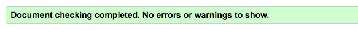
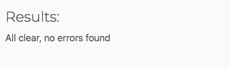
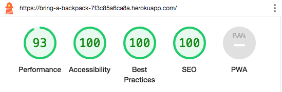

## Functional Testing

| Description                                                                                           | Action                                                                                                                                                                                                                                                                                                                                                   | Expected Result                                                                                                                                                                                        | Pass/Fail |
| ----------------------------------------------------------------------------------------------------- | -------------------------------------------------------------------------------------------------------------------------------------------------------------------------------------------------------------------------------------------------------------------------------------------------------------------------------------------------------- | ------------------------------------------------------------------------------------------------------------------------------------------------------------------------------------------------------ | --------- |
| Test navbar links to ensure they navigate to the respective pages (User Story #2)                     | Testing was performed by clicking on the navigation links                                                                                                                                                                                                                                                                                                | All navigation links get directed to the correct pages as expected                                                                                                                                     | Pass      |
| Test footer links to enure they behave as expected (User Story #3)                                    | Testing was performed by clicking on the social media icons                                                                                                                                                                                                                                                                                              | Icons open the correct social media page and opens in a new tab                                                                                                                                        | Pass      |
| Test destination review page to ensure the reviews can be seen by users (User Story #8)               | Testing was performed by navigating to the Destination page and seeing the reviews displayed                                                                                                                                                                                                                                                             | Destination reviews are on the page ready to be opened and read by user                                                                                                                                | Pass      |
| Test that a new destination review can be added (User Story #13)                                      | User must be logged in. Testing was performed by navigating to the 'Add New' link on the navbar, then selecting 'Destination'. This will open the Add Destination Review page. User must enter the following: Review Title, Brief Review Description, Review Photo, Description of the uploaded photo and a Full Review. Once done, click Create Review! | A new destination review is successfully added onto the Destination page                                                                                                                               | Pass      |
| Test that a destination review can be edited/updated (User Story #10)                                 | User must be logged in and the publisher of the review. Testing was performed by clicking on the published review (either on the Destination page or Profile page), scrolling down to see the Edit button. Clicking on the edit button will prompt the user to confirm the changes to the review.                                                        | The destination review is successfully edited/updated                                                                                                                                                  | Pass      |
| Test that a destination review can be deleted (User Story #11)                                        | User must be logged in and publisher of the review. Testing was performed by clicking on the published review (either on the Destination page or Profile page), scrolling down to see the Delete button. Clicking on the delete button will prompt the user to confirm the deletion.                                                                     | The destination review is successfully deleted                                                                                                                                                         | Pass      |
| Test photography post page to ensure the reviews can be seen by users (User Story #19)                | Testing was performed by navigating to the Photography page and seeing the posts displayed                                                                                                                                                                                                                                                               | Photography posts are on the page ready to be opened and read by user                                                                                                                                  | Pass      |
| Test that a new photography post can be added (User Story #19)                                        | User must be logged in. Testing was performed by navigating to the 'Add New' link on the navbar, then selecting 'Photography'. This will open the Add Photography Post page. User must enter the following: Post Title, Brief Post Description, Main Photo and an additional 9 photos. Once done, click Create Post                                      | A new photography post is successfully added onto the Photography page                                                                                                                                 | Pass      |
| Test that a photography post can be edited/updated (User Story #21)                                   | User must be logged in and the publisher of the post. Testing was performed by clicking on the published post (either on the Photography page or Profile page), scrolling down to see the Edit button. Clicking on the edit button will prompt the user to confirm the changes to the post                                                               | The photography post is successfully edited/updated                                                                                                                                                    | Pass      |
| Test that a photography post can be deleted (User Story #22)                                          | User must be logged in and publisher of the review. Testing was performed by clicking on the published post (either on the Destination page or Profile page), scrolling down to see the Delete button. Clicking on the delete button will prompt the user to confirm the deletion.                                                                       | The photography post is successfully deleted                                                                                                                                                           | Pass      |
| Test that a user can sign up to the website (User Story #6)                                           | Testing was performed by clicking on the Register link on the navbar. User will be prompted to provide the following credentials: Email, Username, Password and Password (again). Once done, click Sign Up                                                                                                                                               | User will be signed up to the website, if successful, the user will be re-directed to the homepage                                                                                                     | Pass      |
| Test that a user can log in once they have signed up (User Story #6)                                  | Testing was performed by signing up to the website first. By typing the Username and Password then clicking on the Sign In button                                                                                                                                                                                                                        | User is successully logged in and re-directed to the homepage                                                                                                                                          | Pass      |
| Test that a user can logout                                                                           | Testing was performed by being logged into the website first. When signed in, there will be a Logout link on the navbar, once clicked, the user will be prompted to confirm that they want to sign out. The Sign Out button must be clicked to successfully logout                                                                                       | User will be logged out                                                                                                                                                                                | Pass      |
| Test that a user can only sign in with the correct credentials (User Story #6)                        | Testing was performed by trying to sign in with the wrong username and/or password                                                                                                                                                                                                                                                                       | If the user uses the wrong Username and/or Password, an error will appear stating that the credentials used are incorrect                                                                              | Pass      |
| Test that a user can create a profile (User Story #14)                                                | Testing was performed by registering and logging into the website. A profile for the user is automatically created once they sign up. To ensure a profile exists, the Profiles link in the navbar is clicked to then inspect the profile page                                                                                                            | A new Profile for the registered and logged in user is automatically created. By clicking on the Profiles link on thr navbar the user will be greeted with their profile page                          | Pass      |
| Test that a user can view their profile (User Story #16)                                              | Testing was performed by being logged in first. Once successfully logged in, the Profile link on the navbar was clicked                                                                                                                                                                                                                                  | The user will be presented with their own profile one they click Profile on the navbar                                                                                                                 | Pass      |
| Test that a user can edit their profile (User Story #15)                                              | Testing was performed by being logged into the website first. Navigating to their profile page and clicking of the Edit Profile button. A modal shall pop up and the user can make any chages they wish to their profile. Users can upload a new display picture, add their nationality, add their traveller type and write a bio                        | The user will be presented with a modal when they click the Edit Profile button. Once the changes have been made, by clicking on the Save Changes button, the chages will be shown on the profile page | Pass      |
| Test that forms cannot be submitted when required fields are empty                                    | Testing was performed by trying to add a new destination review and a new photography post. If one or more fields on the form is empty and the user tries to click the Create button, the form will not submit. Instead, there will be a warning on the empty field.                                                                                     | Required fields must be populated, or else a warning will appear and the form will not be submitted                                                                                                    | Pass      |
| Test to ensure quick links on the homepage navigate to the respective pages (User Story #17)          | Testing was performed by clicking the quick links, which can be found in the bottom half of the homepage.                                                                                                                                                                                                                                                | All quick links get directed to the correct pages as expected                                                                                                                                          | Pass      |
| Test that a user cannot edit another users destination review (User Story #12)                        | Testing was performed by being logged into the website first. Secondly, logging in with a newly created user and creating a new destination review as the newly registered user. By clicking on Edit Review button and then changing the URL to a review that is not published by the logged in user                                                     | The logged in user will be shown a 403 error page stating that they are not access to the page                                                                                                         | Pass      |
| Test that a user cann not delete another users destination review (User Story #12)                    | Testing was performed by being logged into the website first. Secondly, logging in with a newly created user and creating a new destination review as the newly registered user. By clicking on Delete Review button and then changing the URL to a review that is not published by the logged in user                                                   | The logged in user will be shown a 403 error page stating that they are not access to the page                                                                                                         | Pass      |
| Test that a user cannot edit another users photography post (User Story #12)                          | Testing was performed by being logged into the website first. Secondly, logging in with a newly created user and creating a new photography post as the newly registered user. By clicking on Edit Post button and then changing the URL to a post that is not published by the logged in user                                                           | The logged in user will be shown a 403 error page stating that they are not access to the page                                                                                                         | Pass      |
| Test that a user cannot delete another users photography post (User Story #12)                        | Testing was performed by being logged into the website first. Secondly, logging in with a newly created user and creating a new photography post as the newly registered user. By clicking on Delete Post button and then changing the URL to a post that is not published by the logged in user                                                         | The logged in user will be shown a 403 error page stating that they are not access to the page                                                                                                         | Pass      |
| Test that a 404 error page appears if a user navigates to a page that does not exist (User Story #24) | Testing was performed by typing in a URL path that does not exist on the project                                                                                                                                                                                                                                                                         | If the user navigates to a page that does not exist, the user will be shown a 404 error page stating that the page they are looking for does not exist                                                 | Pass      |
| Test that a 500 error page appears if the server encounters an unexpected condition (User Story #25)  | Testing was perfored by logging into Heroku and removing CLOUDINARY_URL from config vars                                                                                                                                                                                                                                                                 | When navigating to any page on the website, it will display the 500 error page to the user                                                                                                             | Pass      |
| Test that the user can search for a destination review using the search bar (User Story #13)          | Testing was performed by clicking onto the Destinations page and type in a name of a city/country that exists as a review and similarly, typing a name of a city/country that doesn't exist as a review                                                                                                                                                  | If the user types a name of a city/country that exists as a review, that review will show up. If typing a name of a city/country that doesn't exist as a review, then nothing shall appear             | Pass      |
| Test that a success toast appears when uplaoding a destination review (User Story #28)                | Testing was performed by being logged in and creating a new destination review                                                                                                                                                                                                                                                                           | When a user creates a new destination review, if it has been uploaded successfully, a toast shall appear stating that the review has been successfully created. Therefore giving feedback to the user. | Pass      |
| Test that a success toast appears when editing a destination review (User Story #28)                  | Testing was performed by being logged in and clicking on the Edit Review button. When the changes have been made, the Save Changes button is clicked                                                                                                                                                                                                     | When a user edits their review, a toast shall appear stating that the review has been successully edited. Therefore giving feedback to the user.                                                       | Pass      |
| Test that a success toast appears whe deleting a destination review (User Story #28)                  | Testing was performed by being logged in and clicking on the Delete Review button and then confirming the deletion of the review                                                                                                                                                                                                                         | When a user deletes their own destination review, a toast shall appear stating that the review was successfully deleted. Therefore giving feedback to the user.                                        | Pass      |
| Test that a success toast appears when uploading a photography post (User Story #29)                  | Testing was performed by being logged in and creating a new photography post                                                                                                                                                                                                                                                                             | When a user creates a new photography post, if it has been uploaded successfully, a toast shall appear stating that the post has been successfully created. Therefore giving feedback to the user.     | Pass      |
| Test that a success toast appears when editing a photography post (User Story #29)                    | Testing was performed by being logged in and clicking on the Edit Post button. When the changes have been made, the Save Changes button is clicked                                                                                                                                                                                                       | When a user edits their photography post, a toast shall appear stating that the post has been successully edited. Therefore giving feedback to the user.                                               | Pass      |
| Test that a success toast appears when deleting a photography post (User Story #29)                   | Testing was performed by being logged in and clicking on the Delete Post button and then confirming the deletion of the post                                                                                                                                                                                                                             | When a user deletes their own photography post, a toast shall appear stating that the post was successfully deleted. Therefore giving feedback to the user.                                            | Pass      |
| Test that a success toast appears when editing a profile (User Story #30)                             | Testing was performed by being logged in a clicking on the Profile page, then clicking on the Edit Profile button. Once changes have been made, the Save Changes button is clicked                                                                                                                                                                       | When a user edits their profile, a toast shall appear stating that their profile has been succcesfully updated. Therefore giving feedback to the user                                                  | Pass      |
| Test that any site user can view the contact page regardless of sign in status (User Story #18)       | Testing was performed both by being signed out and signed in. The Contact link on the navbar was clicked and navigates to the corresponding page                                                                                                                                                                                                         | When the Contact page is clciked, it gets directed to the correct page as expected                                                                                                                     | Pass      |
|                                                                                                       |                                                                                                                                                                                                                                                                                                                                                          |                                                                                                                                                                                                        |           |

## Accessibility 

The [Wave Accessibility](https://wave.webaim.org/) tool was used throughout development and for final testing of the deployed website to check for any aid accessibility testing. 

Testing was conducted to ensure that the following criteria points were met:

* All forms have associated labels or aria-labels so that this is read out on a screen reader to users who tab to form inputs

* Colour contrasts on the site meet a minimum ratio this is specified on the [WCAG 2.1 Contrast Guidelines](https://www.w3.org/WAI/WCAG21/Understanding/contrast-minimum.html)

* Headings levels are not missed or skipped, this is to ensure the importance of content is relayed correctly to the user

* All content is contained within landmarks to ensure ease of use for assistive technology, this will allow the user to navigate by page regions

* All HTML pages have a lang attribute set

* Aria properties have been implemented correctly 

* WCAG 2.1 Coding best practices have been followed

## Validator Testing

All pages were run through the W3 HTML Validator. Initially, some error were flagged due to double ending p tags because the RichTextFields were wrapped with p tags. All of these issues were corrected and all pages passed validation. 

Due to the Django templating language code used in the HTML files, it could not just be copied and pasted into the validator and due to the secured views snd pages with login required cannot be validated by direct URL. To test the validation of the files, the webpage must be opened, right click and view page source. Paste te raw HTML code into the validator as this will be only the HTML rendered code. 

All pages were run through a PEP8 validator to ensure all code was PEP8 compliant. Initially, some errors were flagged due to trailing white space, lines too long and 1 line instead of 2 expected. All these errors were corrected and the code passed through the validator with no issues. There was however one exception, which was the settings.py file. 

The Django auto generated code for AUTH_PASSWORD_VALIDATORS and the STATICFILES_STORAGE for cloudinary ere showing up as too long. I could not find a way to split these lines but since they were auto generated and not my own custom code, I hope this is acceptable.

The JavaScript code used was run through JSHINT JavaScript validator. The only issues it raised was missing semicolons, which were corrected. The only warning that remained was regarding ES6.

## Lighthouse Report

The lighthouse report gave a score of 93, 100, 100, 100.

## Responsiveness

During the styling phase for media queries, all pages were tested to ensure responsiveness on screen sizes from 280px and upwards. All pages were tested on Chrome, Safari and Edge browsers.

Steps to test:

* Open a browser and go to [website](https://bring-a-backpack-7f3c85a6ca8a.herokuapp.com/)
* Right click on the page and select 'Inspect', this will open up developer tools.
* Decrease the screen size to 280px.
* Click and drag the responsive window to set the width for testing.

Expected:

Website is to be responsive on all screen sizes and no images/logos are to be pixelated or distorted due to stretching. No horizontal scroll appears on mobile devices and nothing overlaps.

Actual:

Website behaved as expected.

The website was tested for its responsiveness on the following devices and no issues were observed:

* Samsung Galaxy Fold
* iPad Air
* Surface Pro 7
* Nexus 10